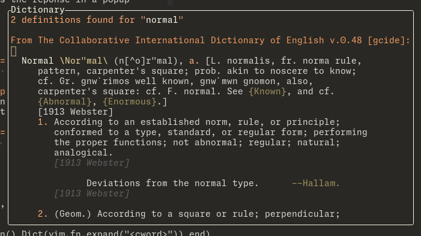

# dict-popup.nvim

A simple plugin for the Linux command `dict` which shows the definitions in a popup.    
Reworked for Neovim ([vim9script version](https://github.com/Nealium/dict-popup.vim))



## Install

### Command
```bash
sudo apt install dictd
# or
sudo dnf install dictd
```
```bash
# extra dictionaries
sudo apt install dict-jargon dict-vera
```
**Note:** Syntax only tested with gcide *(default)*, jargon and vera

### Plugin
* https://github.com/folke/lazy.nvim
```lua
{
    "Nealium/dict-popup.nvim",
    opts = {
        normal_mapping = "<Leader>h",
        visual_mapping = "<Leader>h",
        visual_reg = "v",
        stack = false,
    },
}
```
**Notes:**
* Setting either mapping as `"nil"` (string important) will disable the mapping
* Settings `stack` to `true` will open up a cursor popup ontop of a center popup
  instead of the default behavior which is to overwrite the center popup's
  contents. This *may* lead you with the center popup open and unfocused, to
  refocus do `<C-w><C-w>`

## Usage
Contains two versions, cursor and center popup:
* `normal_mapping` grabs the current word, cursor popup
* `visual_mapping` grabs the current selecting, cursor popup
* ex command `:Dict {word}`, center popup

## Dict buffer keymaps
* `<ESC>` and `q` close popup
* `}` next definition
* `{` previous definition
* `<C-O>` next in search jumplist
* `<C-I>` and `<TAB>` previous in search jumplist
* `<C-]>` search current word
* if stacked, `<C-W>` close popup

# TODO
- [X] Proper config & setup    
- [X] Center popup for `:Dict` command    
- [X] Ability to call `dict.Cursor` inside of a dict popup and have it overwrite
      the current contents    
- [ ] Colors set in config    
